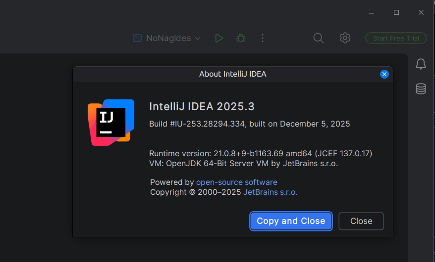
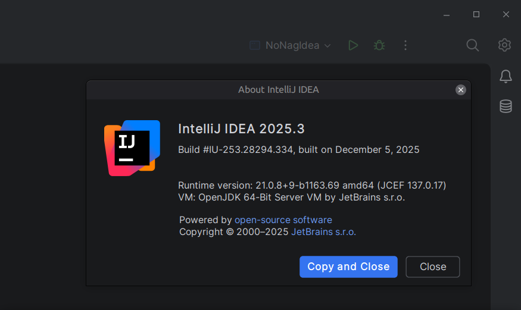

# nonagidea

New IDEA Universal packaging adds a visually distracting permanent `Start Free Trial` nag to push you towards their
Ultimate subscription.

There is no way to configure the UI to remove this, it persists even if you take up the trial offer and then the trial
is ended.

You could download the community build, it does not contain this nag, but they are not exactly promoting the
availability of these builds and you would miss a small number of features.

[Community Builds](https://github.com/JetBrains/intellij-community/releases) at GitHub.

## Demo

### Nag



### No nag



## How To

Open up a terminal:

```shell
cd <your-idea-installation-directory>/lib/modules
rm *trial*
```

Alternatively, you could move them somewhere so you could put them back later.

## FAQ

### Why do this, why are you such a cheapskate?

Really, *on principle*.

These dark patterns are disgusting.

I would pay for an ultimate subscription if I needed one, but I don't, so I won't, at least for now.

And really, it's just annoying seeing it constantly.

### Did you hack/crack it?

No, of course not, all I did was remove some files from my disk.

### What if I update the IDE?

Not sure to be honest. The update may break. The update may just restore the trial module.

In any case, when I update I recommend the manual download option instead of an automatic update.

This is because I install applications in a specific folder not in my `/home` partition, and it takes something like 5gb
of disk space or more to update IDEA in place.

## 2026 Update

```shell
cd <your-idea-installation-directory>lib
rm intellij.platform.trialPromotion.common.jar
```

Appears to be enough.
